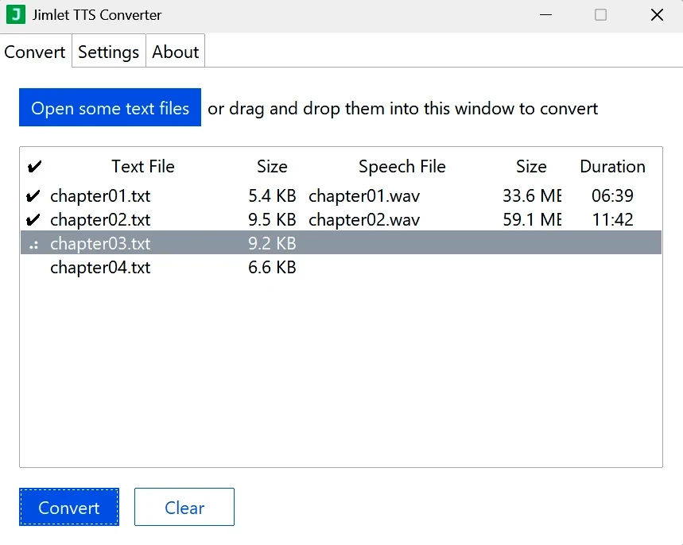
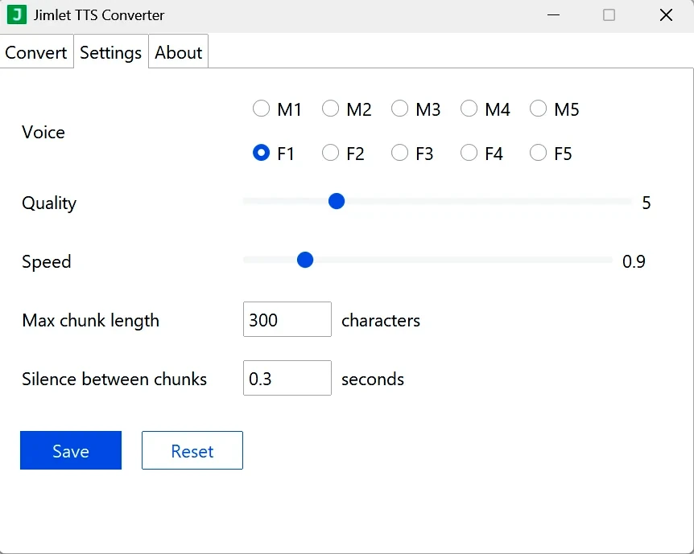

This is a functional early version of **Jimlet TTS Converter**.

The current, more advanced version is packaged as a portable Windows app
and is available at https://jimlet.com .

**Offline text-to-speech converter** for Linux, Windows, and macOS.
Converts text to clear, natural-sounding speech locally.
**Privacy-oriented**: speech is generated on your computer.
**No usage limits**. Runs on normal computers **without a video card**.
Supports drag-and-drop file operations.

**HOW TO RUN**

Create and activate a virtual environment:

```sh
python -m venv venv
source venv/bin/activate.fish
```

Install dependencies:

```sh
pip install -r requirements.txt
```

Run the application from the project root:

```sh
python run.py
```

**HOW TO USE**

 * Add text files by dragging and dropping them into the window,
  or by clicking the "Open" button.
 *  Click "Convert" to create audio files.
 * The converted files are saved in the same folder as the original text files.

The output files have ".wav" extension.
Open them with any audio player to listen.

**UPDATES**

For current version and and information, visit:
https://jimlet.com

<br>

**SCREENSHOTS**




